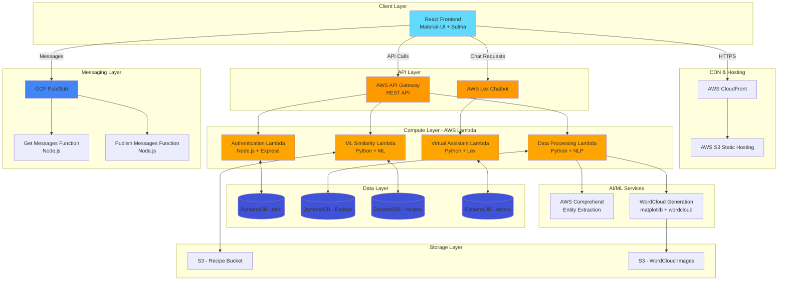

# Architecture Documentation

## System Architecture Diagram



## Component Flow Diagrams

### Authentication Flow

```
User → Login/Register Component → API Gateway → Authentication Lambda → DynamoDB (user table)
                                                                      ↓
                                                            JWT Token/Session ← User
```

### Word Cloud Generation Flow

```
User Reviews → DynamoDB (Ratings) → Data Processing Lambda → AWS Comprehend
                                                           ↓
                                                    Entity Extraction
                                                           ↓
                                                  WordCloud Library
                                                           ↓
                                                    S3 Bucket (Image)
                                                           ↓
                                                    Frontend Display
```

### ML Recommendation Flow

```
New Recipe Upload → S3 Bucket Trigger → ML Lambda Function
                                              ↓
                                    Load All Recipes from S3
                                              ↓
                                    Cosine Similarity Calculation
                                              ↓
                                    Find Most Similar Recipe
                                              ↓
                                    Update DynamoDB (recipes)
                                              ↓
                                    Return Recipe Type
```

### Chat System Flow

```
User Message → Frontend → Publish Message Function → GCP Pub/Sub Topic
                                                            ↓
                                                    Message Queue
                                                            ↓
                                                    Subscription
                                                            ↓
Get Messages Function ← Frontend Poll ← GCP Pub/Sub ← Message Delivery
```

### Chatbot Interaction Flow

```
User Question → React-Lex Component → AWS Lex Bot
                                           ↓
                                    Intent Recognition
                                           ↓
                                    Virtual Assistant Lambda
                                           ↓
                        ┌──────────────────┴──────────────────┐
                        ↓                                      ↓
                Navigation Help                        Order Status Query
                        ↓                                      ↓
                Static Responses                    DynamoDB (orders)
                        ↓                                      ↓
                        └──────────────────┬──────────────────┘
                                           ↓
                                    Response to User
```

## Data Models

### User Table (DynamoDB)
```json
{
  "email": "string (Primary Key)",
  "name": "string",
  "password": "string",
  "type": "string (customer/restaurant)"
}
```

### Ratings Table (DynamoDB)
```json
{
  "ratingId": "string (Primary Key)",
  "restaurantId": "string",
  "userId": "string",
  "rating": "number",
  "comment": "string",
  "timestamp": "string"
}
```

### Recipes Table (DynamoDB)
```json
{
  "dish_name": "string (Primary Key)",
  "Type": "string (category)"
}
```

### Orders Table (DynamoDB)
```json
{
  "orderid": "number (Primary Key)",
  "status": "string",
  "userId": "string",
  "restaurantId": "string",
  "items": "list",
  "timestamp": "string"
}
```

## API Endpoints

### Authentication Service
- `POST /register` - User registration
- `POST /login` - User authentication

### Data Processing Service
- `GET /wordcloud` - Trigger word cloud generation
- `GET /wordcloud/image` - Retrieve word cloud image URL

### Machine Learning Service
- Triggered automatically by S3 events
- `POST /similarity` - Manual similarity check

### Virtual Assistant Service
- Integrated with AWS Lex (no direct HTTP endpoints)
- Intent: `NavigationHelp`
- Intent: `OrderStatus`

### Chat Service
- `GET /messages/:subscription` - Retrieve messages from Pub/Sub
- `POST /messages/:topic` - Publish message to Pub/Sub

## Security Considerations

1. **Authentication**: Session-based with encrypted passwords
2. **API Gateway**: CORS enabled, rate limiting configured
3. **IAM Roles**: Least privilege principle for Lambda functions
4. **Environment Variables**: Sensitive data stored in AWS Systems Manager
5. **S3 Buckets**: Public read for static hosting, private for user data
6. **DynamoDB**: Encryption at rest enabled

## Scalability Features

- **Serverless Architecture**: Auto-scaling Lambda functions
- **CloudFront CDN**: Global content delivery
- **DynamoDB On-Demand**: Automatic capacity scaling
- **S3**: Unlimited storage capacity
- **API Gateway**: Handles millions of requests

## Monitoring & Observability

- **CloudWatch Logs**: Lambda execution logs
- **CloudWatch Metrics**: API Gateway metrics, Lambda duration
- **X-Ray**: Distributed tracing (can be enabled)
- **DynamoDB Metrics**: Read/write capacity monitoring

## Deployment Strategy

1. **Infrastructure**: Terraform provisions all resources
2. **Lambda Functions**: ZIP deployment through Terraform
3. **Frontend**: Build and deploy to S3, invalidate CloudFront cache
4. **Database**: Schema created through Terraform
5. **Secrets**: Managed through AWS Secrets Manager

## Cost Optimization

- **Lambda**: Pay per execution
- **DynamoDB**: On-demand pricing for variable workloads
- **S3**: Lifecycle policies for old data
- **CloudFront**: Cache optimization to reduce origin requests
- **API Gateway**: Caching enabled for frequent requests
